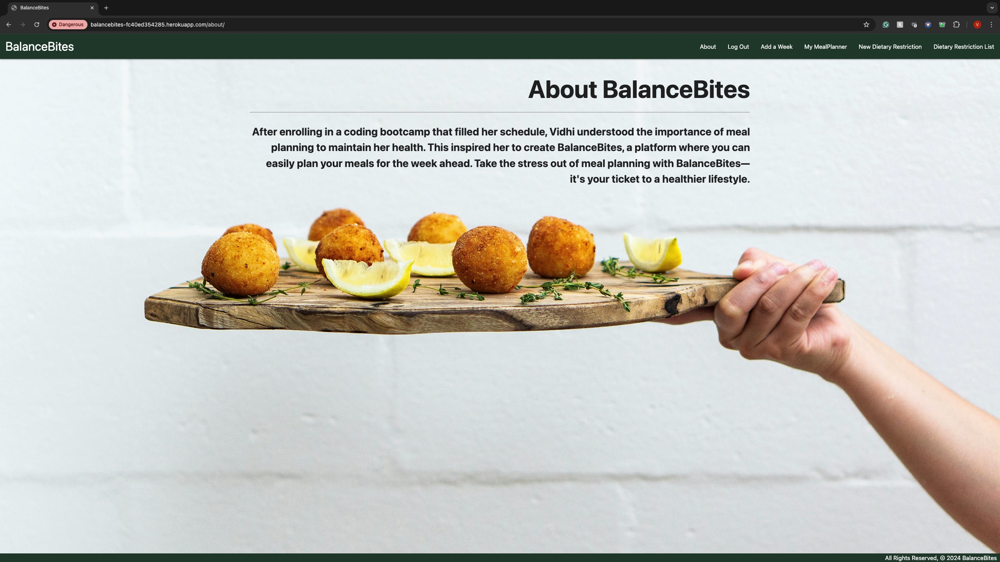
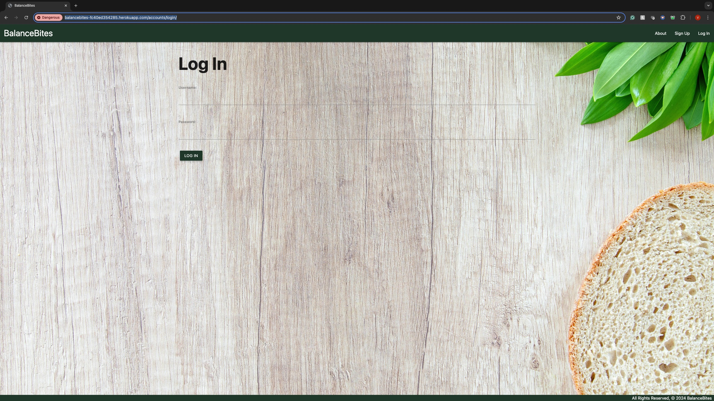
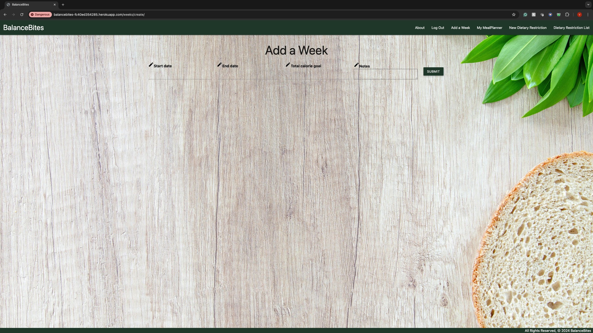
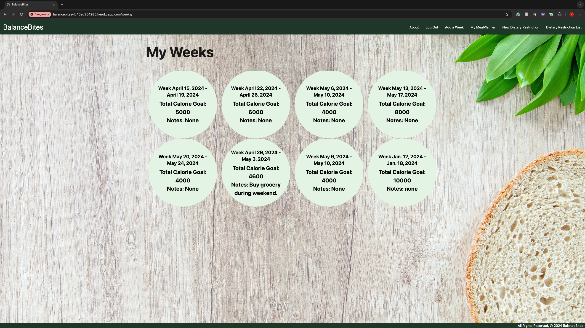
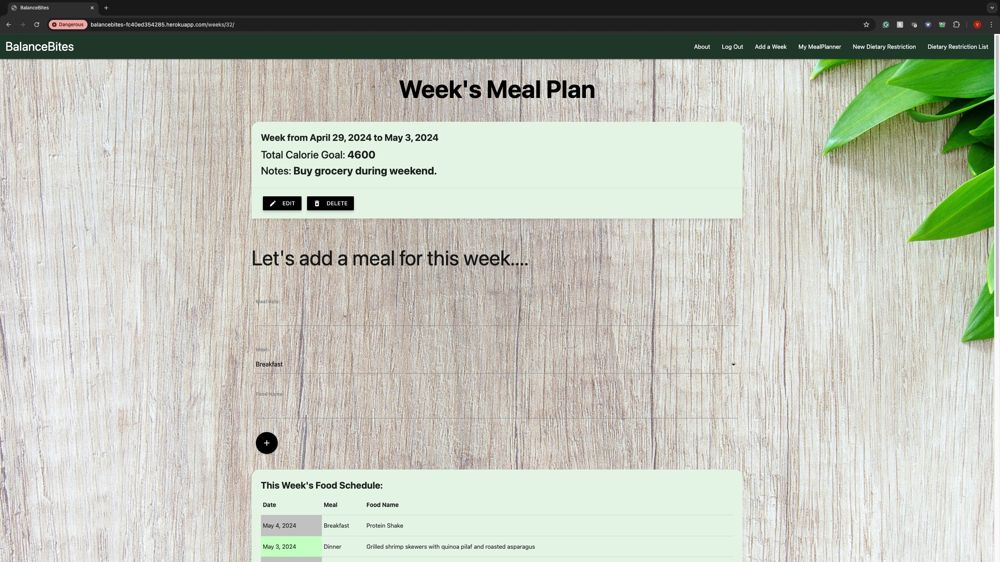
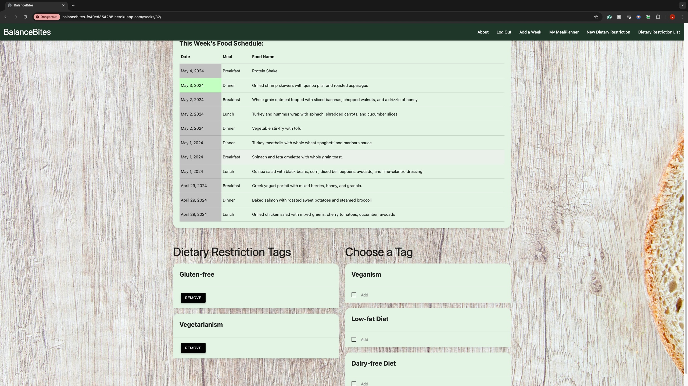
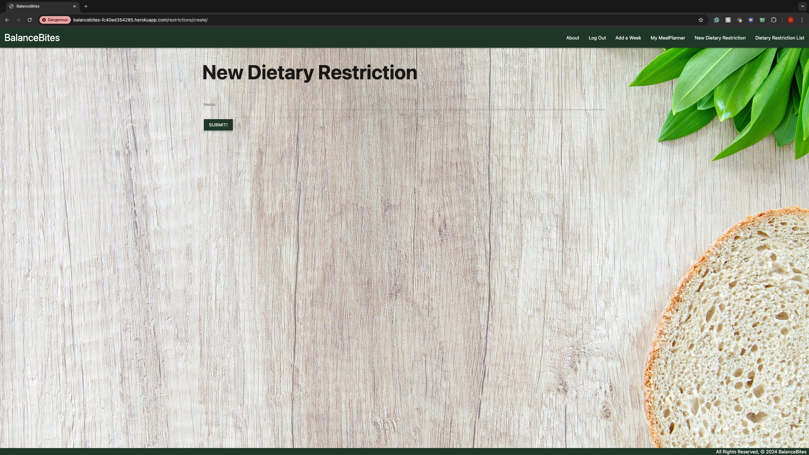
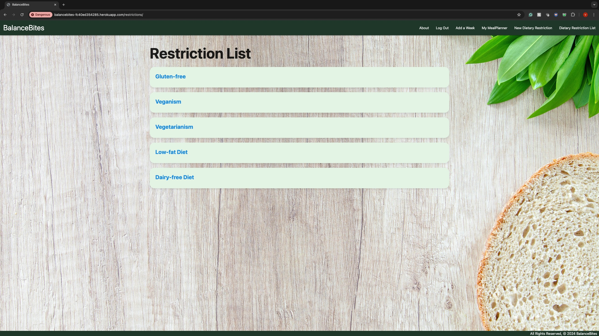

# BalanceBites 
BalanceBites, a platform where you can easily plan your meals for the week ahead. Take the stress out of meal planning with BalanceBites— it's your ticket to a healthier lifestyle. Login to your own personal mealplanner. Add weeks to your mealplanner, and add meals to those weeks. You also have the ability to add dietary restrictions to each week.

# Screenshot

# Technologies Used

- Django
- Python
- POSTGRES 
- SQL
- HTML
- CSS

# Getting Started

[Click to View Project Planning](https://trello.com/b/YCKOPbLI/mealplanner-sei-project-3)

[Click to access the BalanceBites application!](https://balancebites-fc40ed354285.herokuapp.com/accounts/login/)

# Next Steps

- Include a recipe search API
- Integrate a calendar into the application to keep track of weeks added